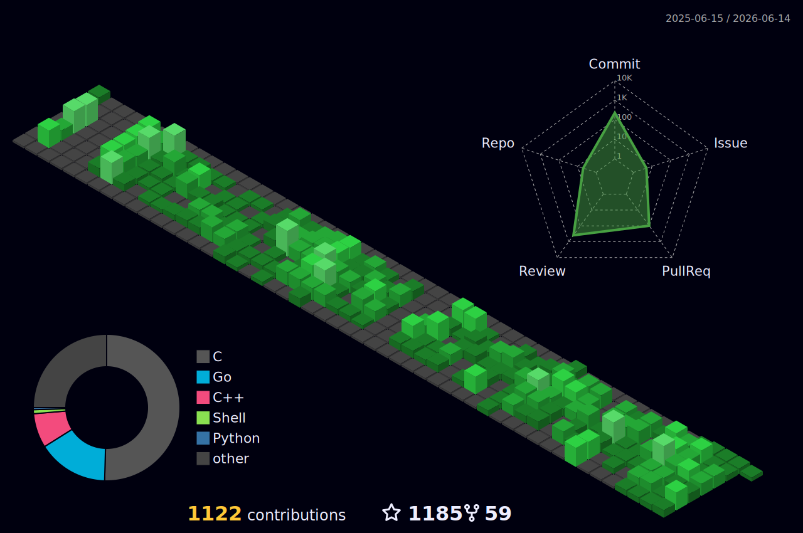

<h2 align="center">Welcome to FedeDP profile! :-) </h2>

# About me

Hi! I am Federico Di Pierro, a Software Engineer from Italy!  
I am currently a Software Engineer Tech Lead @ [Cisco](https://cisco.com/), a [Falco](https://falco.org/) (CNCF graduated project) core maintainer and a [Tetragon](https://tetragon.io/) Member and Committer.

## Metrics

	

## Contributions

	

> Isometric view of contributions in the last year. Languages pie is based on recent commits.

## 🔧 Technologies & Tools

